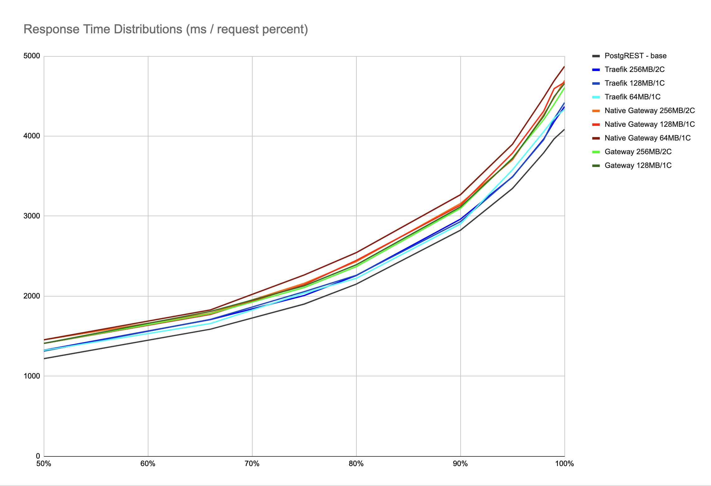
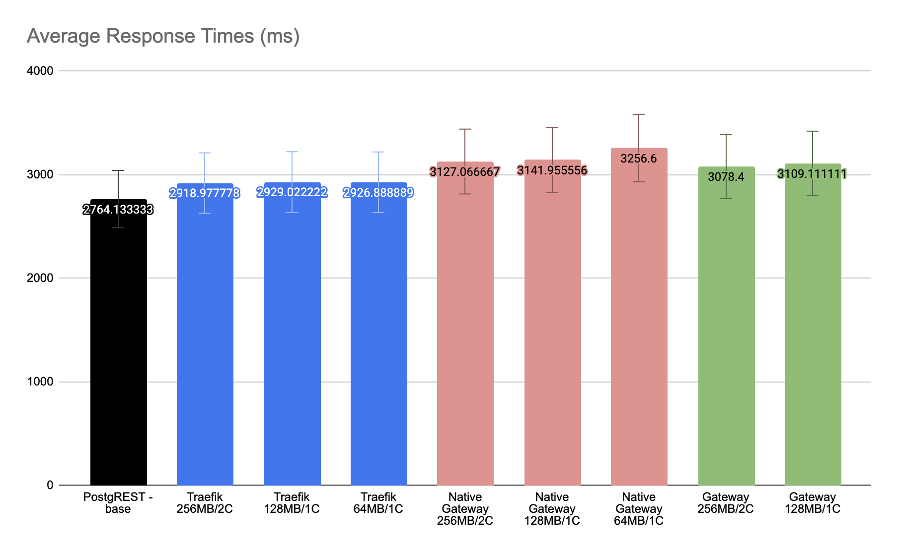

# Spring Cloud Gateway, Native Gateway and Traefik


## Load Test

This repository contains a Spring Cloud Gateway and Traefik examples.

The load used for these tests is 10 time 500 requests with 200 concurrency.

The Spring Cloud Gateway is tested with Java and native compiled forms. 

The applications are tested with 

* 256MB memory/2 CPU cores 
* 128MB memory/1 CPU core.
* 64MB memory/1 CPU core.


## Compile

Here are the steps to compile, native compile and docker image creation instructions.

**How to Compile Java**
```bash
mvn clean install
```

**How to Create Java Docker**
```bash
docker build -t spring-webflux-proxy .
```

**How to Compile Native Executable**
You need GraalVM to compile to native application. One way to install GraalVM is to use SDKMan. You can install the SDK Man from its site https://sdkman.io/install
After that, you can install GraalVM with this command.
```bash
sdk install java 21.3.0.r17-grl
```

You can compile the native executable by running the following command.
```bash
mvn package -Pnative
```

**How to Create Native Docker**
```bash
docker build -f Dockerfile-native -t spring-webflux-proxy-native .
```

## Run

```
# spring-webflux-proxy
docker run -it --rm --memory="256MB" --cpus="2.0" -p 8080:8080 -e "PROXY_HOST=http://$HOST_IP:3000/" --name spring-webflux-proxy spring-webflux-proxy
docker run -it --rm --memory="128MB" --cpus="1.0" -p 8080:8080 -e "PROXY_HOST=http://$HOST_IP:3000/" --name spring-webflux-proxy spring-webflux-proxy

# spring-webflux-proxy-native
docker run -it --rm --memory="256MB" --cpus="2.0" -p 8080:8080 -e "PROXY_HOST=http://$HOST_IP:3000/" --name spring-webflux-proxy-native spring-webflux-proxy-native
docker run -it --rm --memory="128MB" --cpus="1.0" -p 8080:8080 -e "PROXY_HOST=http://$HOST_IP:3000/" --name spring-webflux-proxy-native spring-webflux-proxy-native
docker run -it --rm --memory="64MB" --cpus="1.0" -p 8080:8080 -e "PROXY_HOST=http://$HOST_IP:3000/" --name spring-webflux-proxy-native spring-webflux-proxy-native

# Traefik
docker run -it --rm --memory="256MB" --cpus="2.0" -p 8080:80 -v /var/run/docker.sock:/var/run/docker.sock -v $PWD/traefik.yml:/etc/traefik/traefik.yml --net=tmp_default --name traefik traefik:v2.5
docker run -it --rm --memory="128MB" --cpus="1.0" -p 8080:80 -v /var/run/docker.sock:/var/run/docker.sock -v $PWD/traefik.yml:/etc/traefik/traefik.yml --net=tmp_default --name traefik traefik:v2.5
docker run -it --rm --memory="64MB" --cpus="1.0" -p 8080:80 -v /var/run/docker.sock:/var/run/docker.sock -v $PWD/traefik.yml:/etc/traefik/traefik.yml --net=tmp_default --name traefik traefik:v2.5
```

Apache `ab` is used for the load tests.

```
# Spring Cloud Gateway Request
for i in {1..10}; do ab -n 500 -c 200 "http://localhost:8080/city" ; sleep 1; done

# Traefik Request (postgrest-tmp is already running and it is the base measurement)
for i in {1..10}; do ab -n 500 -c 200 -H Host:postgrest-tmp.docker.localhost http://localhost:8080/city ; sleep 1; done
```

The following are the results for the `ab` tests.

|          | PostgREST - base | Traefik 256MB/2C | Traefik 128MB/1C | Traefik 64MB/1C | Native Gateway 256MB/2C | Native Gateway 128MB/1C | Native Gateway 64MB/1C | Gateway 256MB/2C | Gateway 128MB/1C |
| -------- | ---------------- | ---------------- | ---------------- | --------------- | ----------------------- | ----------------------- | ---------------------- | ---------------- | ---------------- |
| 50%      | 1220.2           | 1325.2           | 1314.4           | 1323.8          | 1456                    | 1410.6                  | 1455.6                 | 1411.4           | 1411             |
| 66%      | 1588.4           | 1708.6           | 1711             | 1658.8          | 1787.8                  | 1772.4                  | 1829                   | 1782.2           | 1810.4           |
| 75%      | 1902.2           | 2008.8           | 2057.2           | 2038.4          | 2161.6                  | 2143.8                  | 2265.6                 | 2108.2           | 2129.4           |
| 80%      | 2151.2           | 2258.6           | 2261.4           | 2224            | 2432.6                  | 2447.6                  | 2544.8                 | 2369.6           | 2393             |
| 90%      | 2824             | 2962.8           | 2931.8           | 2903.2          | 3157.8                  | 3136.4                  | 3268                   | 3096             | 3115.2           |
| 95%      | 3346.8           | 3491.2           | 3493.6           | 3578.6          | 3704                    | 3787.2                  | 3899                   | 3727.4           | 3720.6           |
| 98%      | 3792.8           | 3964.8           | 3955             | 4056.4          | 4268.2                  | 4312.8                  | 4483.2                 | 4207             | 4250.4           |
| 99%      | 3966.2           | 4181.6           | 4218.6           | 4222.4          | 4479.8                  | 4593.4                  | 4692.6                 | 4398.4           | 4494.6           |
| 100%     | 4085.4           | 4369.2           | 4418.2           | 4336.4          | 4695.8                  | 4673.4                  | 4871.6                 | 4605.4           | 4657.4           |
| AVERAGE: | 2764.133333      | 2918.977778      | 2929.022222      | 2926.888889     | 3127.066667             | 3141.955556             | 3256.6                 | 3078.4           | 3109.111111      |






